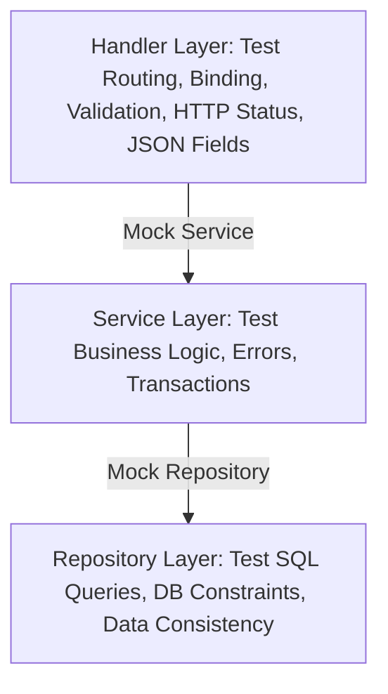

# Hướng dẫn Kiểm thử Toàn diện trong Go (Go Testing Best Practices)

Tài liệu này đúc kết các phương pháp phân tích, giả lập và viết kiểm thử (unit & integration tests) chất lượng cao trong các ứng dụng Go theo kiến trúc nhiều lớp (Layered Architecture).

---

## 1. PHÂN TÍCH VÀ CHIẾN LƯỢC KIỂM THỬ THEO TỪNG LAYER

Khi viết unit test cho các ứng dụng áp dụng mô hình **Handler - Service - Repository**, mỗi lớp có những mục tiêu kiểm thử riêng biệt và đòi hỏi các kỹ thuật giả lập (mocking) khác nhau.



---

## 2. REPOSITORY LAYER TESTING

### Mục tiêu kiểm thử:
- Tính đúng đắn của câu lệnh SQL (chạy thực tế có lỗi cú pháp không).
- Ràng buộc cơ sở dữ liệu (Unique key, Foreign key, Check constraints, Nullability).
- Logic ánh xạ dữ liệu (Data mapping) từ cơ sở dữ liệu lên Go struct.
- Các hàm chạy trong Database transaction.

### Phương pháp kiểm thử tốt nhất:
1. **Integration Test với Real DB (Khuyến nghị)**: Sử dụng một database sạch dành riêng cho test (ví dụ chạy trên Docker / Testcontainers, hoặc PostgreSQL thực tế).
   - **Ưu điểm**: Đảm bảo 100% câu lệnh chạy đúng trên engine thật của database (không lo sự khác biệt hành vi giữa sqlite in-memory và postgresql thật).
   - **Quy tắc**: Mỗi test case hoặc test suite phải tự dọn dẹp dữ liệu của chính mình sau khi chạy (`t.Cleanup`), tránh ô nhiễm dữ liệu giữa các test.
2. **SQLMock**: Sử dụng thư viện `github.com/DATA-DOG/go-sqlmock` để mock database connection và giả lập các tập kết quả.
   - **Ưu điểm**: Không cần database thực tế, chạy siêu nhanh.
   - **Nhược điểm**: Không kiểm chứng được cú pháp SQL có thực sự tương thích với DB thật hay không.

### Các kịch bản cần giả lập & kiểm thử:
- **Tạo bản ghi mới thành công** -> Kiểm tra xem các trường tự động sinh (ID, CreatedAt) có dữ liệu hợp lệ hay không.
- **Lấy bản ghi theo ID/Email**:
  - Trường hợp tồn tại -> Kiểm tra tất cả các trường dữ liệu ánh xạ chính xác.
  - Trường hợp không tồn tại -> Trả về lỗi `pgx.ErrNoRows` hoặc lỗi rỗng chuẩn, không được panic.
- **Vi phạm ràng buộc cơ sở dữ liệu**:
  - Thêm bản ghi trùng trùng lặp email (Unique Constraint) -> Assert trả về lỗi có mã lỗi DB cụ thể (ví dụ lỗi postgres code `23505`).
- **Giao dịch (Transaction)**:
  - Commit thành công -> Dữ liệu lưu vào DB.
  - Một trong các câu lệnh lỗi -> Toàn bộ transaction rollback thành công.

---

## 3. SERVICE/USE CASE LAYER TESTING

### Mục tiêu kiểm thử:
- Logic nghiệp vụ (Business logic) cốt lõi của ứng dụng.
- Luồng xử lý lỗi và bọc lỗi (Error wrapping & formatting).
- Kiểm tra tính đúng đắn của đầu vào trước khi lưu trữ.

### Phương pháp kiểm thử tốt nhất:
- Sử dụng **Mockery** để sinh mock tự động cho Repository Layer.
- Inject mock repository vào service và thiết lập kỳ vọng `.On(...).Return(...)`.

### Các kịch bản cần giả lập & kiểm thử:
- **Happy Paths (Luồng thành công)**: Mock repo trả về dữ liệu đúng, service xử lý logic đúng và trả về kết quả thành công.
- **Repository Errors (Lỗi từ tầng lưu trữ)**:
  - Giả lập repo trả về lỗi kết nối DB, lỗi ghi dữ liệu -> Service phải bắt được lỗi, bọc thêm ngữ cảnh (context) lỗi và trả về lỗi chuẩn.
- **Business Logic Validation**:
  - Tạo tài khoản khi email đã tồn tại -> Mock repo GetByEmail trả về một user hợp lệ -> Service phải chặn lại và trả về lỗi nghiệp vụ (ví dụ: `ErrEmailAlreadyExists`).
  - Xác thực OTP -> OTP sai, OTP hết hạn -> Service trả về đúng lỗi nghiệp vụ tương ứng.

---

## 4. HTTP HANDLER LAYER TESTING

### Mục tiêu kiểm thử:
- Ánh xạ đường dẫn (HTTP Routing) và Middleware.
- Ràng buộc dữ liệu từ HTTP request (JSON binding, query params, headers).
- Validation ở tầng HTTP (ví dụ kiểm tra các tag validate của struct request).
- HTTP Status Code trả về tương ứng.
- **Bảo mật và lọc dữ liệu đầu ra (Security & JSON Field Filtering)**.

### Phương pháp kiểm thử tốt nhất:
- Sử dụng `net/http/httptest` và `gin.CreateTestContext(w)`.
- Mock Service Layer bằng Mockery để cô lập hoàn toàn Handler với Business logic.
- Gọi trực tiếp hàm handler bằng cách truyền Gin context để tối ưu tốc độ và đơn giản hoá cấu trúc test.

### Các kịch bản cần giả lập & kiểm thử:
- **Success Response (Chuẩn hóa)**:
  - Assert HTTP Status (`200 OK`, `201 Created` hoặc `204 NoContent`).
  - Unmarshal JSON response và kiểm tra cấu trúc envelope chuẩn (Ví dụ: `Code: "0"`, `Data` có kiểu dữ liệu đúng).
- **Error Response (Chuẩn hóa)**:
  - Thất bại do logic nghiệp vụ -> Trả về lỗi chuẩn, assert mã lỗi nghiệp vụ trong body.
- **Validate Payload (HTTP Request validation)**:
  - Truyền request thiếu trường bắt buộc, sai email format -> Assert HTTP Status `422 Unprocessable Entity` (hoặc `400 Bad Request`) và mã lỗi validation `"VALIDATION_FAILED"`.
- **Response Fields Validation (Cực kỳ quan trọng)**:
  - **Mục tiêu**: Đảm bảo không rò rỉ dữ liệu nhạy cảm.
  - **Cách test**: Unmarshal dữ liệu `Data` trả về trong JSON sang một map thô `map[string]any`. Assert sự tồn tại của các trường cần thiết (`id`, `name`, `email`), và assert sự **vắng mặt** (hoặc `nil`) của các trường nhạy cảm như `password`, `password_hash`, `secret_key`, `otp_code`.

---

## 5. CÁC NGUYÊN TẮC VÀNG TRONG GO TESTING

1. **Table-Driven Tests**: Sử dụng cấu trúc danh sách test cases (`struct{name string, input ..., want ..., err ...}`) để viết kiểm thử ngắn gọn, bao phủ nhiều trường hợp dễ dàng:
   ```go
   tests := []struct {
       name    string
       email   string
       wantErr bool
   }{
       {"Valid email", "test@example.com", false},
       {"Invalid email", "invalid-email", true},
   }
   for _, tt := range tests {
       t.Run(tt.name, func(t *testing.T) {
           // Execute and assert
       })
   }
   ```
2. **Sử dụng `t.Helper()`**:
   - Khi viết các hàm assertion hoặc setup phụ trợ, hãy khai báo `t.Helper()` ở đầu hàm để khi test fail, Go test runner sẽ báo lỗi chính xác ở dòng gọi hàm helper trong file test gốc thay vì báo lỗi bên trong helper.
3. **Sử dụng `t.Cleanup()`**:
   - Ưu tiên dùng `t.Cleanup(func() { ... })` để dọn dẹp tài nguyên (đóng file, xoá DB test, stop mock) thay vì dùng lệnh defer. `t.Cleanup` đảm bảo chạy kể cả khi test bị panic hoặc thoát sớm.
4. **Cô lập Mocks (Subpackages Mocks Layout)**:
   - Tránh gom tất cả mocks vào một package `mocks` duy nhất ở root dự án để tránh lỗi **Import Cycle** (Vòng lặp import trong test).
   - Hãy chia nhỏ mocks ra các subpackage tương ứng của từng layer, ví dụ:
     - Mock Repo ở `internal/repository/mocks` (package `mocks` nội bộ).
     - Mock Service ở `internal/service/mocks` (package `mocks` nội bộ).
